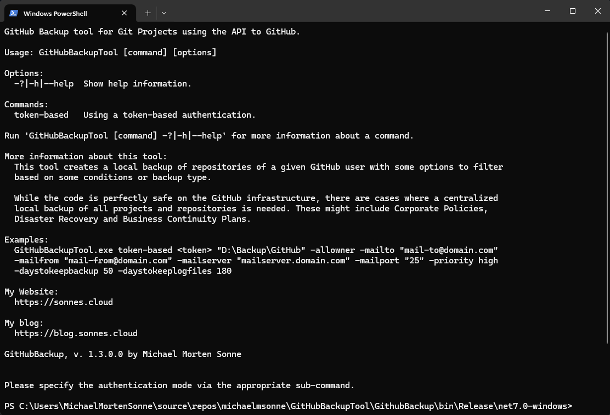
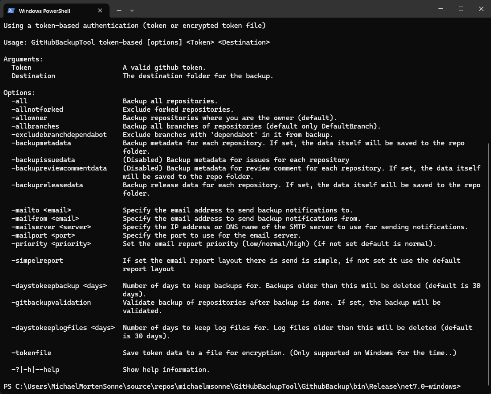
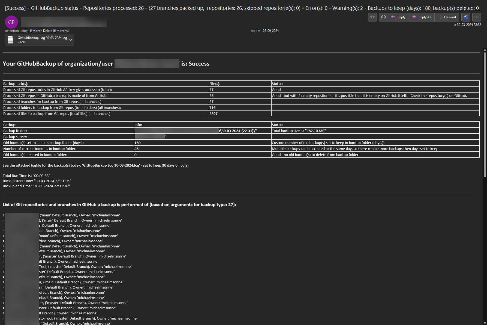

# GitHubBackupTool

<p align="center">
  <a href="https://github.com/michaelmsonne/GitHubBackupTool"></a>
  <a href="https://github.com/michaelmsonne/GitHubBackupTool"></a>
  <a href="https://github.com/michaelmsonne/GitHubBackupTool"></a>
</p>

<div align="center">
  <a href="https://github.com/michaelmsonne/GitHubBackupTool/issues/new?assignees=&labels=bug&template=01_BUG_REPORT.md&title=bug%3A+">Report a Bug</a>
  ·
  <a href="https://github.com/michaelmsonne/GitHubBackupTool/issues/new?assignees=&labels=enhancement&template=02_FEATURE_REQUEST.md&title=feat%3A+">Request a Feature</a>
  .
  <a href="https://github.com/michaelmsonne/GitHubBackupTool/discussions">Ask a Question</a>
</div>

## Table of Contents
- [Introduction](#introduction)
- [Contents](#contents)
- [Features](#features)
- [Download](#download)
- [Getting Started](#getting-started)
  - [Prerequisites](#prerequisites)
  - [Installation](#installation)
- [Usage](#usage)
- [Examples](#examples)
- [Contributing](#contributing)
- [License](#license)

## Contents

Outline the file contents of the repository. It helps users navigate the codebase, build configuration and any related assets.

| File/folder       | Description                                 |
|-------------------|---------------------------------------------|
| `\GithubBackup`   | Source code.                                |
| `\Installer`      | Installer project.                          |
| `.gitignore`      | Define what to ignore at commit time.       |
| `CHANGELOG.md`    | List of changes to the sample.              |
| `CONTRIBUTING.md` | Guidelines for contributing to the project. |
| `README.md`       | This README file.                           |
| `SECURITY.md`     | Security file.                              |
| `LICENSE`         | The license for the project.                |

# Introduction
This tool creates a local backup of repositories of a given GitHub user with some options to filter based on some conditions.
You can also use it to backup all repositories of an organization of you created a personal access token with the right permissions under there.

All repositories of the given GitHub API key will be concurrently cloned to the provided destination folder if selected.

If you don´t provide a destination folder in the argument, the backup will be created in your current folder there the application is executed.

While your code is perfectly safe on the GitHub infrastructure, there are cases where a centralized local backup of all projects and repositories is needed. These might include Corporate Policies, Disaster Recovery and Business Continuity Plans.

By using the GitHubBackupTool, you can automate the process of creating backups of your GitHub repositories, ensuring that your valuable code is safe and easily recoverable.

## Use

## Features

### Overall:
- Asynchronous Resolution: Utilizes asynchronous processing for improved performance and responsiveness, allowing users to continue working while backups are being created.
- Simplicity and Ease of Use: Provides a straightforward and user-friendly method for creating backups from GitHub repositories.

### List:
- Backup Functionality:
  - Repository Backup: Enables users to create local backups of GitHub repositories.
  - Customizable Backup Options: Offers various command-line options to tailor the backup process, including specifying backup directories, , types of repositories and branches, token authentication, cleanup, backup retention period, and more.
  - Automated Cleanup: Supports cleanup functionality to manage the disk space occupied by the backup files.
  - Backup Retention: Allows users to specify the number of days to retain backups, automatically removing older backups based on the set retention period using the --daystokeepbackup argument.

- Email Reporting:
  - Email Notifications: Sends detailed email reports upon backup completion, providing status updates, backup job information, and relevant details.
  - Email Customization: Offers different email layouts (--simpelreportlayout) to cater to varying preferences or requirements.
  - Priority Configuration: Provides the option to set email priority (--priority) for the backup completion notification.
 
- Logging:
  - Job Logging: Stores logs for backup jobs in a designated folder (.\Log) for a defined period (default: 30 days) beside the **GitHubBackupTool.exe** executable.

The tools and code in it can as much of the same features as my [Azure DevOps Backup tool](https://github.com/michaelmsonne/AzureDevOpsBackupTool), but with some changes to support the GitHub API. Some functions/data/API data is not the same, so some features/stat/status checks is not here at the movemt (we hope in the future).

### Getting GitHub repos API key give access too


### Createing GitHub of reposs basd on parameters to backup


### Backup done and report send


# Console use:

**Help and info menu:**

Main menu:



Sub menu:



# Email report sample

**Full layout:**



**Simple layout:**


## Building

## Download

[Download the latest version](../../releases/latest)

[Version History](CHANGELOG.md)

## Getting Started
### Prerequisites
- [.NET Core SDK](https://dotnet.microsoft.com/download) installed on your system.

### How to build

- Get [Visual Studio 2022](https://visualstudio.microsoft.com/vs/community/) (Community Edition is fine)
- Install ".NET desktop development" workload  
  
- Remember to select: Install .NET 7.0 Runtime
- Build the solution in Visual Studio

### Access token:

You can create a personal access token here: https://github.com/settings/tokens/new

**Recommended scopes and use is for better security**: https://github.com/settings/personal-access-tokens/new

- **Repository access**: All repositories
- **Contents**: Read-only
- **Metadata**: Read-only

Other scopes you can use:
- Comming as more features added if needed...

**Access**: Read access to repositories who needs backup and read access to user profile.


### Installation
You can either clone this repository and build the project yourself.

## Usage

```bash
GitHubBackupTool token-based <token> [<destination>] [<backuptype>] -mailto "mail-to@domain.com" -mailfrom "mail-from@domain.com" -mailserver "mailserver.domain.com" -mailport <port> -priority "high" -daystokeepbackup <days> -daystokeeplogfiles <days>
```

etc.: 
```bash
GitHubBackupTool token-based <token> "D:\Backup\GitHub\" -allowner -mailto "mail-to@domain.com" -mailfrom "mail-from@domain.com" -mailserver "mailserver.domain.com" -mailport <port> -priority "high" -daystokeepbackup 50 -daystokeeplogfiles 180
```

Paramenters (**NOT FINAL**):

- token-based
    - token.bin: Use an encrypted .bin file (based on hardware ID´s) with your GitHub personal access token in. 
    (Remember to run -tokenfile <token.data> to create the file first beside the application .exe!)
    - <token.data>: Replace this with your GitHub personal access token.
- "D:\Backup\GitHub\": Specify the local directory where you want to store the GitHub repository backups.
- -allowner: Use this option to back up repositories owned by the token holder.
- -all: Use this option to back up all repositories the token have access to.
- -allnf: Use this option to back up repositories owned by the token holder and exclude forked repositories..
- -allowner: Use this option to back up repositories owned by the token holder.
- -allbranches: Use this option to back up all branches of repositories (default only DefaultBranch) by the token holder.
- -excludebranchdependabot: Use this option to exclude the branches with the name "dependabot" from the backup.
- -mailto "mail-to@domain.com": Provide an email address where backup completion notifications will be sent.
- -mailfrom "mail-from@domain.com": Specify the sender's email address for the notification emails.
- -mailserver "mailserver.domain.com": Define the SMTP server for sending email notifications.
- -mailport "25": Set the SMTP server port (default is 25).
- -priority "high": Specify the email priority for notifications (e.g., high, normal, low).
- -daystokeepbackup 180: Set the number of days to retain backup files before automatic removal (default is 30 days if not set).
- -daystokeeplogfiles 180: Set the number of days to retain log files before automatic removal (default is 30 days if not set).
- -backupmetadata: Backup metadata for each repository. If set, the code itself will be saved to the repo folder.
- -backupreleasedata: Backup release data for each repository. If set, the code itself will be saved to the repo folder.

# Final thoughts
This is not an exhaustive method to retrieve every artifact on GitHub. There’s a lot more to be done to make this a complete solution.
However, it’s a good starting point to backup your GitHub projects and keep a local repository of these like I do! 😜😉

There is send an email report to the specified email address when the backup is done with status and usefull information about the backup job and more information.

You can also use the tool to backup all repositories of an organization of you created a personal access token with the right permissions under there.

And the tool can also be used to backup all repositories of a user.

Use it in a scheduled task to backup your repositories every day or week or month or whatever you want manually or automatically.

```bash
$ dotnet publish -r win10-x64 -c release
```

So far I tested the application only for win10-x64 systems, but it might also work on other platforms.

## Used 3rd party libraries for the tool:

[Octokit.NET](https://github.com/octokit/octokit.net)

[McMaster's CommandLineUtils](https://github.com/natemcmaster/CommandLineUtils)

[Newtonsoft.Json](https://github.com/JamesNK/Newtonsoft.Json)

[LitGit2Sharp](https://github.com/libgit2/libgit2sharp)

[Autofac](https://github.com/autofac/Autofac)

[ShellProgressBar](https://github.com/Mpdreamz/shellprogressbar)

# Contributing
If you want to contribute to this project, please open an issue or submit a pull request. I welcome contributions :)

See [CONTRIBUTING](CONTRIBUTING.md) for more information.

First off, thanks for taking the time to contribute! Contributions are what makes the open-source community such an amazing place to learn, inspire, and create. Any contributions you make will benefit everybody else and are **greatly appreciated**.
Feel free to send pull requests or fill out issues when you encounter them. I'm also completely open to adding direct maintainers/contributors and working together! :)

Please try to create bug reports that are:

- _Reproducible._ Include steps to reproduce the problem.
- _Specific._ Include as much detail as possible: which version, what environment, etc.
- _Unique._ Do not duplicate existing opened issues.
- _Scoped to a Single Bug._ One bug per report.

# Support

Reach out to the maintainer at one of the following places:

- [GitHub discussions](https://github.com/michaelmsonne/GitHubBackupTool/discussions)
- The email which is located [in GitHub profile](https://github.com/michaelmsonne)

# License
This project is licensed under the **MIT License** - see the LICENSE file for details.

See [LICENSE](LICENSE.md) for more information.

# Sponsors
## Advanced Installer
The installer is created from a Free Advanced Installer License for Open-Source from <a href="https://www.advancedinstaller.com/" target="_blank">https://www.advancedinstaller.com/</a> - check it out!

[](https://www.advancedinstaller.com/)

## SAST Tools
[PVS-Studio](https://pvs-studio.com/en/pvs-studio/?utm_source=github&utm_medium=organic&utm_campaign=open_source) - static analyzer for C, C++, C#, and Java code.